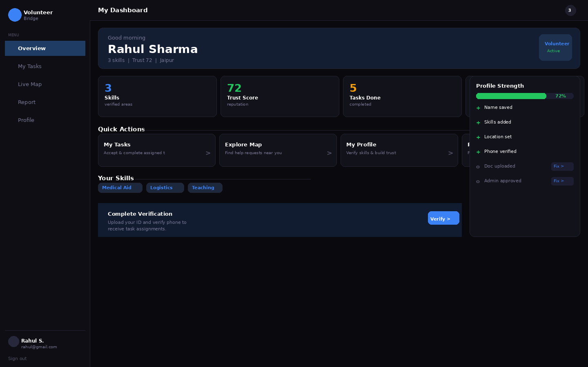
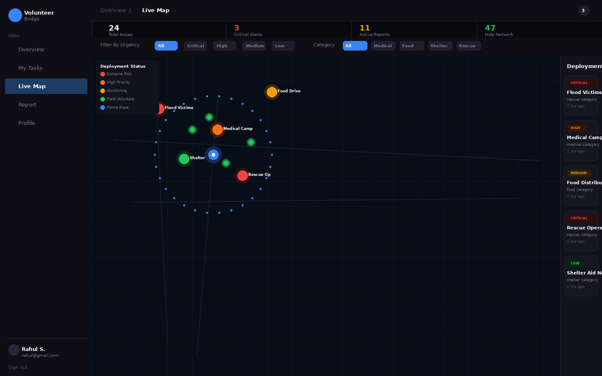
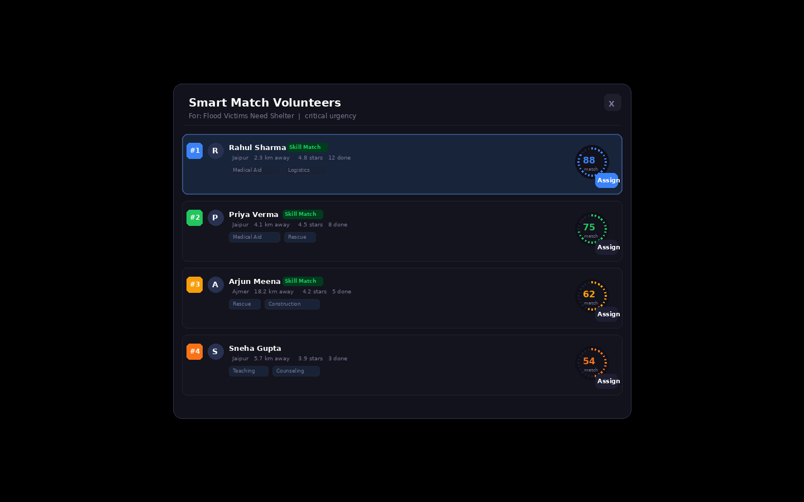
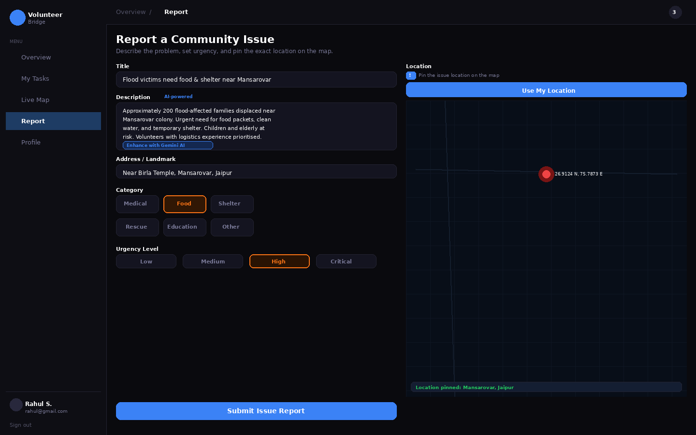

# VolunteerBridge — Demo Guide

> **Google Solution Challenge Submission**
> A 2-minute walkthrough of the full volunteer → task → completion flow.

---

## Demo Video

[](https://loom.com/share/YOUR_LOOM_LINK_HERE)

> **[https://loom.com/share/YOUR_LOOM_LINK_HERE](https://loom.com/share/YOUR_LOOM_LINK_HERE)**
>
> Duration: ~2 minutes | No login required to view

---

## Live App

| Environment | URL |
|---|---|
| Production (Firebase) | [https://volunteerbridge-310d5.firebaseapp.com/](https://volunteerbridge-310d5.firebaseapp.com/) |
| Alternate (Vercel) | [https://google-solution-challenge-hackathon.vercel.app/](https://google-solution-challenge-hackathon.vercel.app/) |

---

## Demo Credentials

Use these pre-seeded accounts (from `seed_volunteers_with_auth.sql`) to explore both roles instantly — no sign-up required.

| Role | Email | Password |
|---|---|---|
| NGO Admin | `admin@demo.volunteerbridge.in` | `Demo@1234` |
| Volunteer | `volunteer@demo.volunteerbridge.in` | `Demo@1234` |

> These accounts are pre-loaded with task history, trust scores, and location data so all features are immediately visible.

---

## What the Demo Covers (2-Minute Flow)

The video walks through the **complete end-to-end lifecycle** of a crisis event:

### Step 1 — NGO Admin: Report a Crisis (0:00–0:25)
- Admin logs in and opens the **Issue Report** form
- Drops a GPS pin on the live **Leaflet crisis map** for the crisis location
- Types a rough description → clicks **"Enhance with Gemini AI"**
- Gemini 2.0 Flash rewrites it into a structured, actionable crisis brief in real time
- Admin submits the issue (urgency: **Critical**, category: **Medical**)

### Step 2 — Smart Match Engine Runs (0:25–0:50)
- Admin opens **Admin Dashboard → Smart Match panel**
- Clicks "Find Best Volunteers" for the new issue
- The PostGIS `smart_match_volunteers()` function scores all available volunteers in real time across:
  - Skill overlap (35%) · GPS proximity (30%) · Trust Score (25%) · Availability (10%)
- Top-ranked volunteers appear with their **match %, distance, and skill tags**
- Admin assigns the top match with one click

### Step 3 — Volunteer: Receives & Accepts the Task (0:50–1:20)
- Volunteer logs in — the **real-time notification bell** lights up immediately (Supabase Realtime)
- Volunteer opens **My Tasks** and sees the newly assigned crisis with full details
- Clicks **"Accept"** → status updates live on the admin dashboard simultaneously
- Clicks **"Start Task"** → task moves to `in_progress`

### Step 4 — Volunteer: Submits Proof of Work (1:20–1:40)
- After completing the action on the ground, the volunteer clicks **"Submit Proof"**
- Enters a completion report (e.g., "Administered first aid, patient stabilised")
- Submits → task status flips to `completed`; admin receives a real-time notification

### Step 5 — Admin: Rates the Volunteer & Trust Score Updates (1:40–2:00)
- Admin opens the **Rating Panel** and rates the volunteer (1–5 stars + comment)
- The `recalculate_trust_score()` Postgres function fires automatically
- Volunteer's **Trust Score badge** updates live on their profile
- The crisis issue is marked **Resolved** — loop closed

---

## Screenshots

| Screen | Preview |
|---|---|
| Dashboard Overview |  |
| Live Crisis Map |  |
| Smart Match Engine |  |
| Issue Report + Gemini AI |  |

---

## Key Technical Moments to Watch

| Timestamp | What to Notice |
|---|---|
| ~0:18 | Gemini AI issue enhancement — raw text → structured brief in ~1 second |
| ~0:35 | Smart Match scores appear — PostGIS running a weighted geospatial query live |
| ~0:52 | Notification bell badge updates on Volunteer dashboard without a page refresh |
| ~1:45 | Trust Score re-renders immediately after admin submits a rating |

---

## How to Run It Yourself (5 Minutes)

```bash
# 1. Clone
git clone https://github.com/your-username/VolunteerBridge.git
cd VolunteerBridge/frontend

# 2. Add your keys in frontend/.env
VITE_SUPABASE_URL=...
VITE_SUPABASE_ANON_KEY=...
VITE_GEMINI_API_KEY=...

# 3. Install & run
npm install
npm run dev
# → http://localhost:5173
```

Run `supabase_FULL_SETUP.sql` then `seed_volunteers_with_auth.sql` in your Supabase SQL editor before starting.
Full setup instructions in [README.md](./README.md).

---

## SDGs Addressed

| Goal | How VolunteerBridge Helps |
|---|---|
| **SDG 11** — Sustainable Cities & Communities | Faster, smarter community crisis response through AI dispatch |
| **SDG 13** — Climate Action | Coordinates disaster relief volunteers during climate-linked emergencies |
| **SDG 17** — Partnerships for the Goals | Bridges NGOs and volunteers into a unified, accountable network |

---

## Google Technologies in the Demo

- **Gemini 2.0 Flash** — Live in Steps 1 and throughout via the in-app chatbot
- **Firebase Hosting** — Powers the production deployment
- **Leaflet Maps** — The geospatial crisis map visible throughout

---

*Built for the Google Solution Challenge by a team passionate about using AI to accelerate humanitarian response across India and beyond.*
